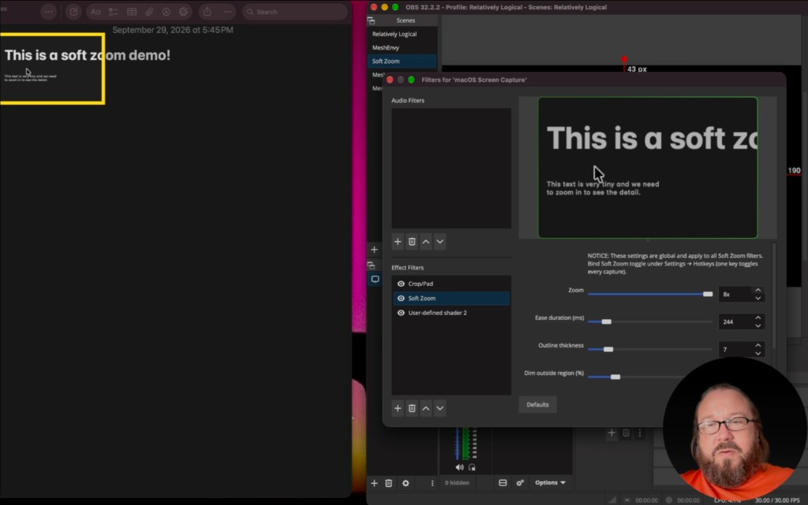

# Soft Zoom



Third-party macOS screen-capture filter for OBS Studio: hotkey zoom locked to the cursor, optional on-screen outline and dim (not in the stream).

**Version:** 0.1.0 (OBS Studio 31.1.x, macOS 12+, universal). See [CHANGELOG.md](CHANGELOG.md).

**Walkthrough:** [https://youtu.be/fWRiG7zi914](https://youtu.be/fWRiG7zi914)

## Install

### From a release

Download the latest `obs-soft-zoom-*-macos-universal.zip` from [GitHub Releases](https://github.com/benallfree/soft-zoom/releases), unzip `obs-soft-zoom.plugin` into `~/Library/Application Support/obs-studio/plugins/`, and restart OBS.

### Build locally

Build, install into OBS, and reload (recommended):

```bash
./scripts/build-and-install-macos.sh
```

Then fully quit and reopen OBS.

Manual build only (see [obs-plugintemplate](https://github.com/obsproject/obs-plugintemplate) docs):

```bash
cmake --preset macos
cmake --build build_macos --config RelWithDebInfo
cp -R build_macos/rundir/RelWithDebInfo/obs-soft-zoom.plugin \
  ~/Library/Application\ Support/obs-studio/plugins/
```

Package a release artifact:

```bash
chmod +x scripts/release-macos.sh
./scripts/release-macos.sh
```

Output goes to `dist/`. Tag `v0.1.0` (match `buildspec.json` `version`) and attach the zip with `gh release create`.

## Use

1. Add **Soft Zoom** to each macOS **Screen Capture** source you want (Filters).
2. Open Soft Zoom on any one of those sources and set zoom (2x / 4x / 8x), ease, outline, dim, anchor, and follow mouse. **These options are global.** They apply to every Soft Zoom filter and are saved in the plugin config, not per layer in the scene. Use **Reset all to defaults** to restore factory settings for every Soft Zoom instance.
3. Bind **Soft Zoom toggle** once under **Settings → Hotkeys** (search `soft zoom`).
4. Press the hotkey to zoom **all** captures that have Soft Zoom; press again to restore all.

Turn on **Hide OBS from capture** on the screen capture if the overlay appears in the preview.

### Global settings vs per capture

| Shared (global) | Per capture |
| --- | --- |
| Zoom, ease, outline, dim, anchor, follow mouse | Whether Soft Zoom filter is on the source |
| Soft Zoom toggle hotkey (Settings → Hotkeys) | Anchor at toggle time (each display uses its own cursor position) |

Edit Soft Zoom on any capture to change globals for every instance. One hotkey master-toggles zoom on every filter: if any capture is zoomed, all zoom out; otherwise all zoom in.

If several full-screen captures are stacked in one scene, only the topmost visible source is what you see in the preview. Hide or move layers above a capture if you need to see its zoom in the canvas.

Zoom uses the filter input after Crop/Pad: at 2× you see half the width and half the height of that image, centered on the cursor (clamped inside the crop). The yellow outline is the same sample window on the monitor. With several captures on a scene, select the source that should drive the outline, or rely on the sole visible capture when only one is shown.

## Disclaimer

Soft Zoom is an independent third-party plugin. It is not developed by, affiliated with, or endorsed by the OBS Project or OBS Studio.

Source is available under GPL-2.0-or-later. See [LICENSE](LICENSE).
